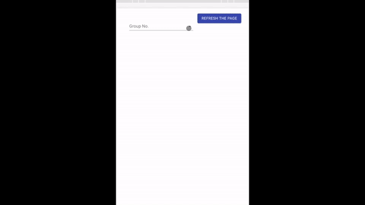

## Leaderboard 心动指南针排行榜

### Overview
  A leaderboard and management system I created for an activity held by a Chinese student organization at NYU. 
  
  > Rankings of each group are computed at the backend by comparing scores and then saved to the database. 
  > Top 5, top 10, top 20 and the rest of the groups are catogrized by different ui elements.
  
  > group managers can update group names and group profiles.
  > administrators can update scores of each team.
  
### Tools
  * frontend: create-react-app and material-ui
  * backend: express
  * database: firebase
  * deployed backend api via heroku

### Demo
  * leaderboard: https://www.cssanyu.org/2020/heartbeat-leaderboard/
  * management groups: https://www.cssanyu.org/2020/heartbeat-leaderboard/manage
  * updating score: https://www.cssanyu.org/2020/heartbeat-leaderboard/score
  
  
  
